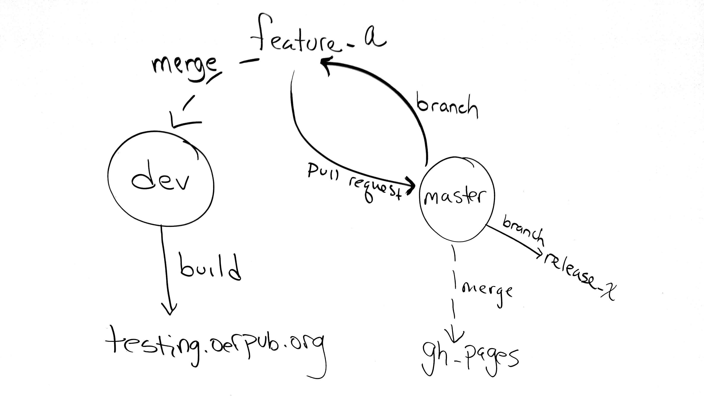

# How we use branches and pull requests and redmine tickets:
## Branches
* We have one long lived branch -- master.
* Testing is done by running a clone in a vagrant box and merging in feature and bug-fix branches.
* Releases and gh-pages will run off of master.
* New features or bug fixes branch from master.
  * Bug fix branches should use any relevant ticket number in their name (currently using pivotal and github issues).

## Releases
* oerpub releases to remix.oerpub.org as close to immediately after new things are merged to master. 
* Each release will be tagged. Major releases will get release branches. 
* For releases that accumulate multiple features and fixes, a branch from master should be used to collect all the 
changes that will be released together.

## Pull requests
* Pull requests go from feature and fix branches to master.
* Before merging to master, the pull request must be code reviewed and tested. When each is approved (code review, test)
a comment on the pull request should indicate the approval. When both approval comments are there, the pull request can
merged to master

# Workflow 1: OERPUB developer creating a new feature or fixing a bug.
1. Make a feature-or-fix branch off of master.
2. Develop and test on the branch.
3. Merge to a local testing branch and build
4. Issue a pull request from the feature-or-fix branch to master. This can be after testing or simultaneous. If after 
testing, be sure to indicate in a comment on the pull request that testing already passed.
5. Someone not-affiliated with the branch will review the request and ensure testing passes.
   * 5A. Pull request is accepted
     * merge pull-request into master, delete branch
     * merge master to gh-pages
     * optional: make a release branch off master and release the new feature or fix to remix.oerpub.org
   * 5B. Pull request is not accepted
     * Resolve the problem or
     * Revert the merge on testing or
     * Create a new branch from master

# Workflow 2: CNX developer creating a new feature or fixing a bug.
1. Make a feature-or-fix branch off of master.
2. Develop and test on the branch.
3. Issue a pull request to master.
4. Test 
5. If the testing passes, do 5A from above, otherwise 5B.

# Workflow 3: Outside developer creating a new feature or fixing a bug.
0. Fork the repo.
1. Create a great new feature or fix a really annoying bug on a branch off of master.
2. Test it like crazy.
3. Issue a pull request to master on the oerpub/Aloha-Editor repo.
4. If the pull request looks good, our team will pull the branch over to a testing branch and test it. If the testing passes, do 5A from above, otherwise 5B.

# Note that the image below uses the name "dev" for the integration testing branch that we now call "testing".

